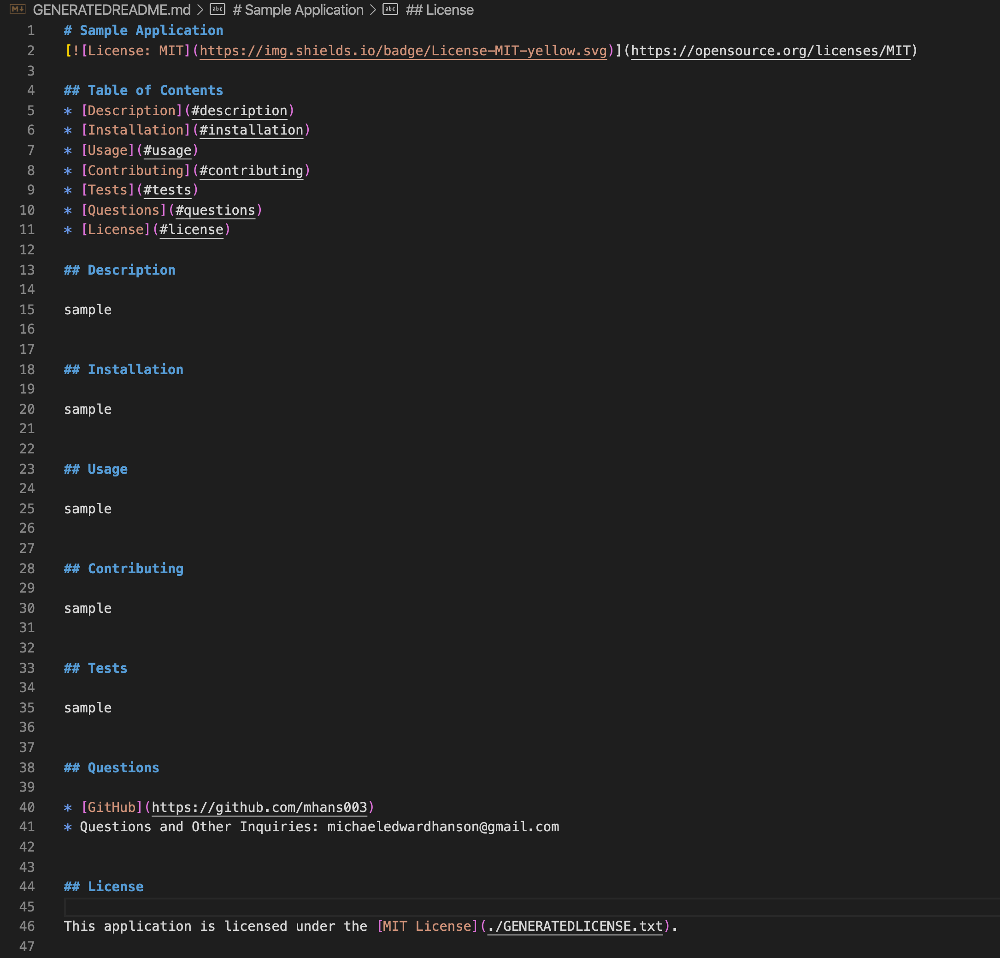

# Good README Generator

## Description 

This CLI Node.js application allows a user to generate a quality README file based on Inquirer prompts in the terminal. 

When this program is run using Node.js (node index.js) in the terminal, the user will be prompted to enter information for a README file, including common categories such as the description, installation information, contribution information, and usage information. The user will type in the full response to each prompt, pressing ENTER to move on to the next question/prompt. When the user is asked to select a license, there will be a dropdown list of common licenses to select. The user will use the spacebar to select a license, then ENTER to move on to the next question/prompt. This will also create a LICENSE.txt file as well as a badge and link to the license file in the README. When the program finishes running, the README file and the LICENSE file will be readily available in the current directory as GENERATEDREADME.md and GENERATEDLICENSE.txt (console message will be provided that confirms this). The user will then be able to copy, rename, and move these files to anywhere they are needed. 

The program ensures that the headings for each section of the README as well as the table of contents will be automatically created. They will also be created in the same order as presented to the user. 

## Features

* Runs in the command line using Node.js.
* Written in Javascript. 
* Includes Inquirer to receive user input via command line. 
* Separate licenses.js file holds all information for the licenses, including badges and full text.
* Includes synchronous fs methods to ensure README categories are generated in predictable order.

## Credits

Michael Hanson
* michaeledwardhanson@gmail.com
* [GitHub](https://github.com/mhans003)
* [LinkedIn](https://www.linkedin.com/in/michaeledwardhanson/)

## License 

Licensed under the [MIT License](./LICENSE.txt).
